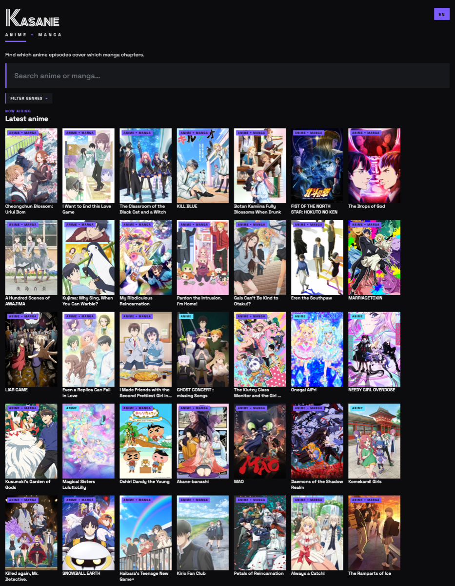
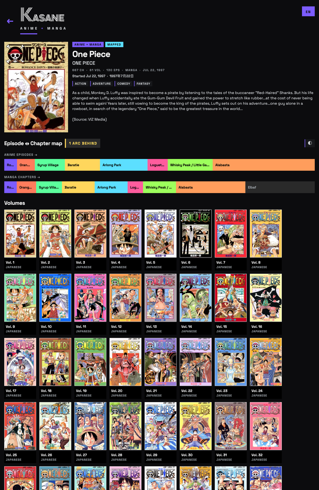
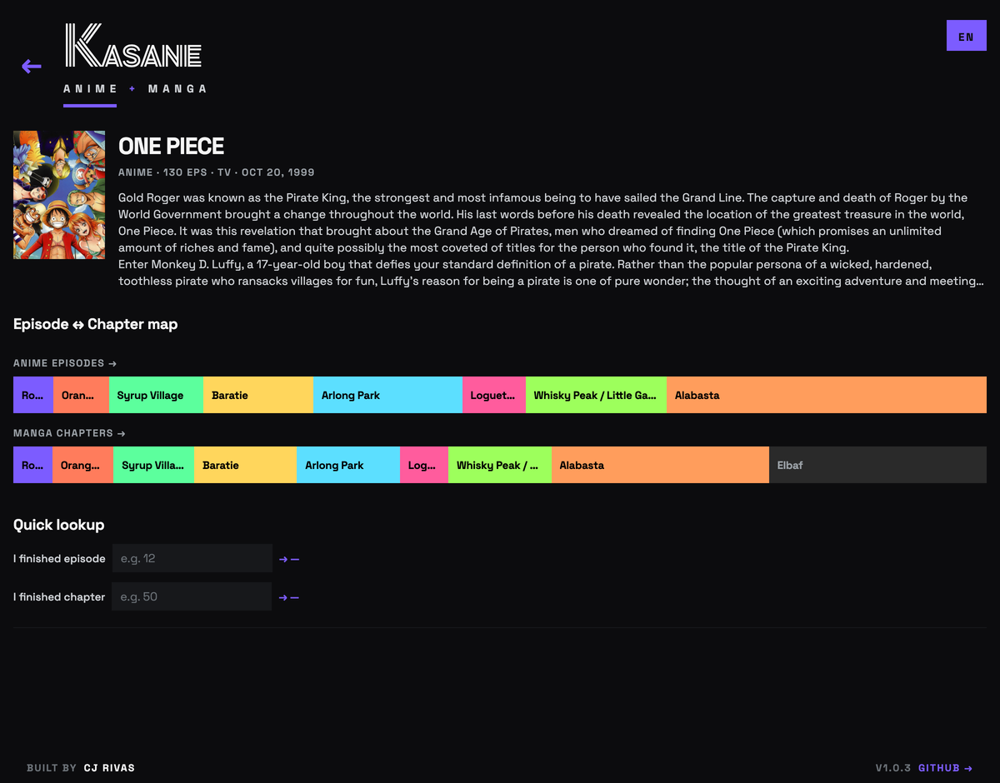
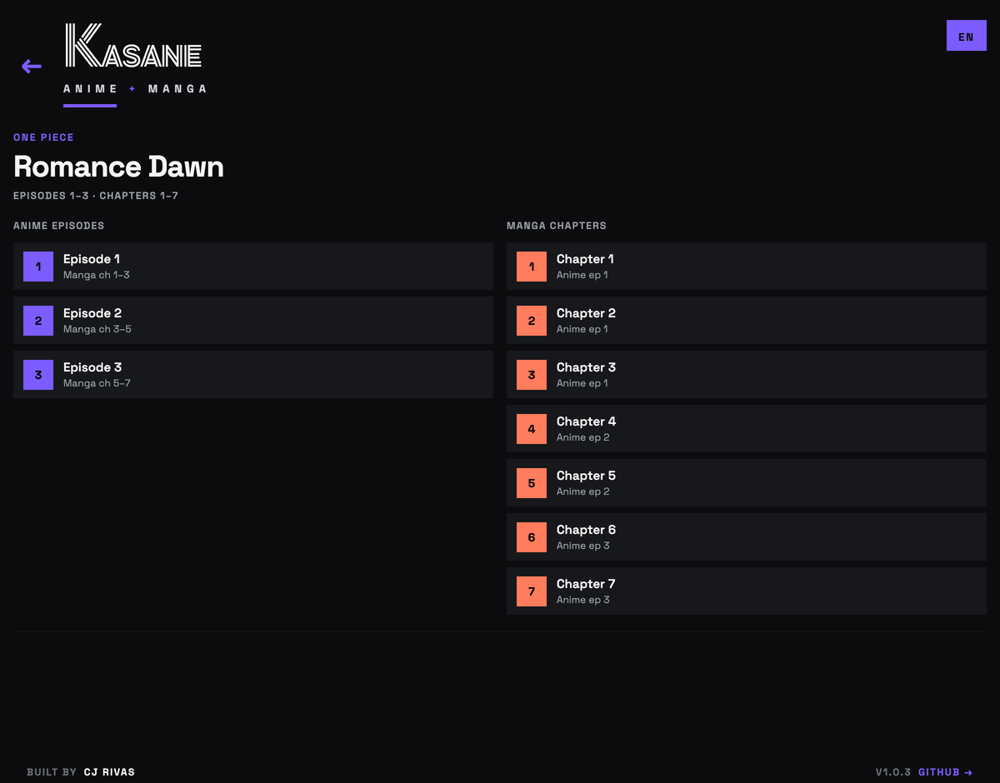

# Kasane

> **kasane** (重ね) — _Japanese: to layer, to overlap._ Anime episode and manga chapter, side by side.

Find which **anime episodes** cover which **manga chapters**, and vice versa — one app, every platform.

Three use cases:

1. **Manga reader** — check if an anime adaptation exists for a series, and how much of the manga it covers.
2. **Anime viewer** — figure out which manga volume to buy to continue from where the anime left off.
3. **Both** — follow a chapter↔episode guide while consuming both.

## Screenshots

Browse and search the catalog:



Series detail — arc-level rail mapping anime episodes to manga chapters, with MangaDex volume covers below:



Anime-side view with the _Quick lookup_ form ("I finished episode X → you're on chapter Y"):



Drill into a single arc to see per-episode ↔ per-chapter alignment:



## Platforms (one codebase)

| Platform                | How it ships                  |
| ----------------------- | ----------------------------- |
| iOS                     | Expo / EAS Build              |
| Android                 | Expo / EAS Build              |
| Web                     | `expo export -p web` (static) |
| macOS / Windows / Linux | Tauri 2 wraps the web build   |

## Stack

- **Expo (React Native + RN Web)** + **TypeScript**
- **Expo Router** for file-based universal routes
- **TanStack Query** + **Zustand**
- **AniList GraphQL** for anime/manga metadata
- Bundled JSON in `src/data/mappings/` for episode↔chapter alignments
- **Tauri 2** for desktop binaries

## Getting started

```bash
bun install
bun run start
bun run web         # browser
bun run ios         # iOS simulator (Mac + Xcode required)
bun run android     # Android emulator
bun run typecheck
```

## Desktop builds (macOS / Windows / Linux)

Desktop is shipped via Tauri 2 wrapping the Expo web export. One-time setup:

1. Install Rust: `curl --proto '=https' --tlsv1.2 -sSf https://sh.rustup.rs | sh`
2. Initialize the desktop project (creates `src-tauri/`):
   ```bash
   bun run build:web                       # produces dist/
   bunx tauri init \
     --app-name kasane \
     --window-title "Kasane" \
     --frontend-dist ../dist \
     --before-build-command "bun run build:web" \
     --dev-url ""
   ```
3. Run / build:
   ```bash
   bun run desktop:dev       # dev window
   bun run desktop:build     # native binary
   ```

## Contributing a mapping

1. Find the AniList anime ID and manga ID for the series.
2. Add a file at `src/data/mappings/<slug>.json` following the schema in `src/types/index.ts` → `SeriesMapping`.
3. Import it in `src/data/index.ts`.

The mapping schema:

```json
{
  "anilistAnimeId": 21,
  "anilistMangaId": 30013,
  "title": "One Piece",
  "mappings": [
    { "episodes": [1, 3], "chapters": [1, 7], "arc": "Romance Dawn" }
  ]
}
```

Episode and chapter ranges are inclusive.

## Project layout

```
app/                    # Expo Router routes
  _layout.tsx
  index.tsx             # search
  series/[id].tsx       # detail with rail + quick lookup
src/
  api/anilist.ts        # GraphQL client
  components/           # SeriesCard, EpisodeChapterRail
  data/                 # bundled mappings + lookup helpers
  types/                # shared TS types
docs/superpowers/specs/ # design docs
src-tauri/              # desktop wrapper (added after web bundle works)
```

## License

MIT (TBD)
