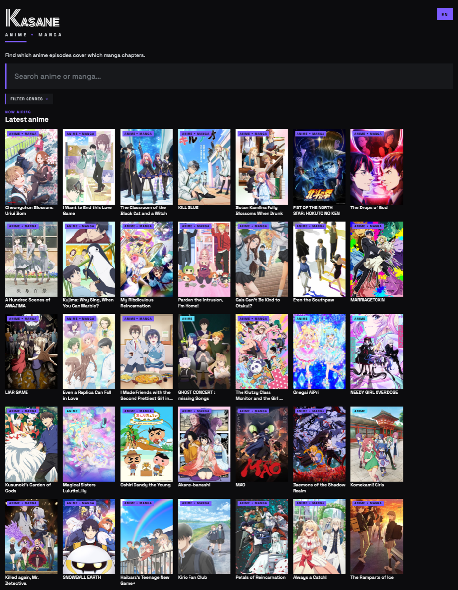
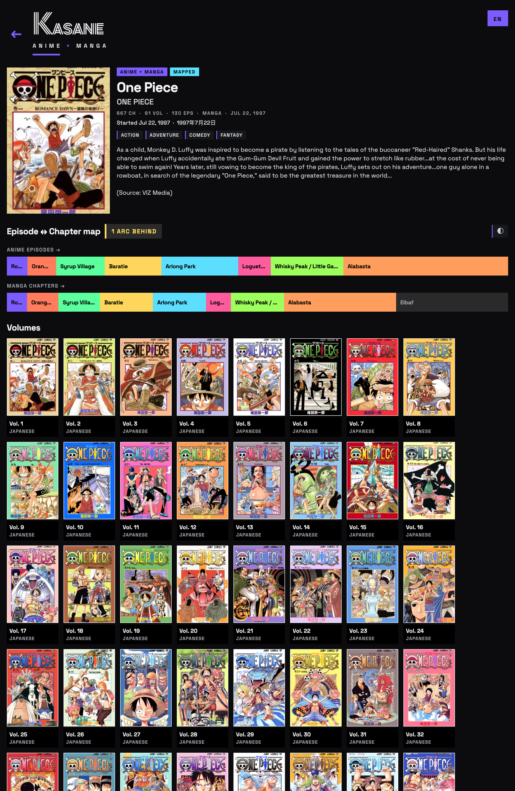
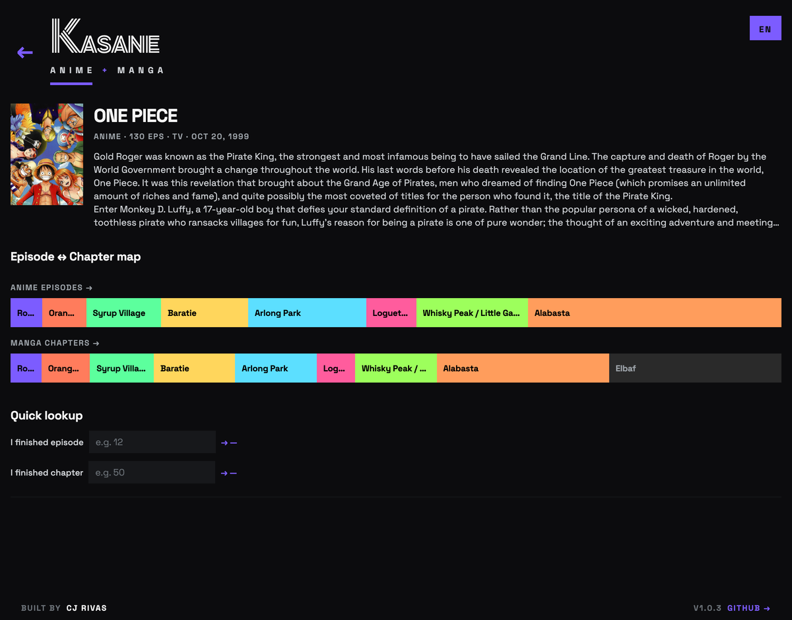
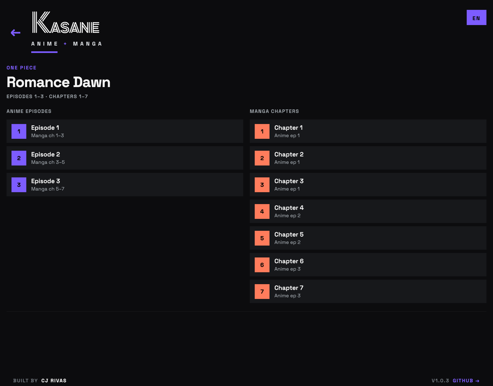

# Kasane

> **kasane** (重ね) — _Japanese: to layer, to overlap._ Anime episode and manga chapter, side by side.

Find which **anime episodes** cover which **manga chapters**, and vice versa — one app, every platform.

**Live on the web:** <https://kasane.netlify.app>

Three use cases:

1. **Manga reader** — check if an anime adaptation exists for a series, and how much of the manga it covers.
2. **Anime viewer** — figure out which manga volume to buy to continue from where the anime left off.
3. **Both** — follow a chapter↔episode guide while consuming both.

## Screenshots

Browse and search the catalog:



Series detail — arc-level rail mapping anime episodes to manga chapters, with MangaDex volume covers below:



Anime-side view with the _Quick lookup_ form ("I finished episode X → you're on chapter Y"):



Drill into a single arc to see per-episode ↔ per-chapter alignment:



## Platforms (one codebase)

| Platform                | How it ships                              |
| ----------------------- | ----------------------------------------- |
| iOS                     | Expo / EAS Build                          |
| Android                 | Expo / EAS Build                          |
| Web                     | `expo export -p web`, deployed to Netlify |
| macOS / Windows / Linux | Tauri 2 wraps the web build               |

## Stack

- **Expo (React Native + RN Web)** + **TypeScript**
- **Expo Router** for file-based universal routes
- **TanStack Query** + **Zustand**
- **AniList GraphQL** for anime/manga metadata
- **MangaDex API** for volume covers (proxied through Netlify in production —
  see `netlify.toml`)
- **Supabase** (Postgres + RLS + Auth) for episode↔chapter mappings, search
  aliases, genre filters, and — behind optional email/password accounts —
  synced user progress/preferences
- **Tauri 2** for desktop binaries

## Getting started

```bash
bun install
bun run start
bun run web         # browser
bun run ios         # iOS simulator (Mac + Xcode required)
bun run android     # Android emulator
bun run typecheck
bun run test
bun run system-check  # typecheck + prettier + lint + test + web build
```

The web app deploys to Netlify from `netlify.toml` (which also configures the
MangaDex proxy and SPA fallback).

## Desktop builds (macOS / Windows / Linux)

Desktop is shipped via Tauri 2 wrapping the Expo web export. One-time setup:

1. Install Rust: `curl --proto '=https' --tlsv1.2 -sSf https://sh.rustup.rs | sh`
2. Initialize the desktop project (creates `src-tauri/`):
   ```bash
   bun run build:web                       # produces dist/
   bunx tauri init \
     --app-name kasane \
     --window-title "Kasane" \
     --frontend-dist ../dist \
     --before-build-command "bun run build:web" \
     --dev-url ""
   ```
3. Run / build:
   ```bash
   bun run desktop:dev       # dev window
   bun run desktop:build     # native binary
   ```

## Contributing a mapping

Mappings live in Supabase — the `series`, `arc_mappings`, and `movies` tables
(see `supabase/migrations/`) — not in the repo, so a new or corrected mapping
reaches every client on next launch with no app release. The catalog tables are
read-only under RLS; write via the Supabase dashboard, SQL editor, or a
service-role script.

1. Find the AniList anime ID and manga ID for the series.
2. Insert a `series` row and its arcs:

```sql
with s as (
  insert into series (anilist_anime_id, anilist_manga_id, title)
  values (21, 30013, 'One Piece')
  returning id
)
insert into arc_mappings
  (series_id, position, episode_start, episode_end, chapter_start, chapter_end, arc)
select s.id, v.*
from s, (values
  (0, 1, 3, 1, 7, 'Romance Dawn')
) as v(position, episode_start, episode_end, chapter_start, chapter_end, arc);
```

Episode and chapter ranges are inclusive; omit `episode_start`/`episode_end`
for manga-only arcs.

## Project layout

```
app/                    # Expo Router routes
  _layout.tsx
  index.tsx             # home: browse + search
  login.tsx             # sign in / sign up
  series/[id]/          # combined detail (+ arc/ drill-down)
  anime/[id]/           # anime-side view (+ arc/)
  manga/[id]/           # manga-side view (+ arc/)
src/
  api/                  # AniList GraphQL, MangaDex, Supabase clients
  components/           # SeriesCard, EpisodeChapterRail, VolumesGrid, ...
  data/                 # catalog fetch, search aliases, genre filters
  state/                # zustand stores: auth, progress, preferences, sync
  types/                # shared TS types + generated Supabase types
supabase/migrations/    # database schema
scripts/                # seed-supabase.ts
docs/superpowers/       # design specs and plans
netlify.toml            # web deploy: headers, MangaDex proxy, SPA fallback
src-tauri/              # desktop wrapper (generated by tauri init; not checked in)
```

## Agents and skills

The repo ships its own Claude Code agents (`.claude/agents/`) and skills
(`.claude/skills/`). Agents are dispatched as subagents for a scoped
investigation; skills load domain-specific guidance before a matching change.

### Agents

| Agent                 | What it does                                                                                                                     | When it's triggered                                                                  |
| --------------------- | -------------------------------------------------------------------------------------------------------------------------------- | ------------------------------------------------------------------------------------ |
| `catalog-auditor`     | Investigates a single catalog finding or series and returns a verdict plus a concrete correction, not a summary.                 | Triaging `scripts/audit-mappings.ts` output — one dispatch per flagged series.       |
| `coverage-gap-finder` | Finds popular adapted series with no curated mapping and ranks them as a research backlog.                                       | Deciding what to map next, or any question about catalog coverage.                   |
| `convention-reviewer` | Reviews a diff against this repo's conventions — CLAUDE.md TypeScript/style rules, token structure, platform and RLS boundaries. | Reviewing kasane changes where a generic code review would miss repo-specific rules. |

### Skills

| Skill                   | What it does                                                                                              | When it's triggered                                                                          |
| ----------------------- | --------------------------------------------------------------------------------------------------------- | -------------------------------------------------------------------------------------------- |
| `accessibility`         | Screen-reader, contrast, and keyboard-nav guidance for kasane's interactive elements and visualisations.  | Adding or editing any `Pressable`, `TextInput`, `Link`, cover image, the rail, or the pie.   |
| `arc-mapping`           | Adds a brand-new series to the catalog: AniList ID lookup, arc research, Supabase inserts.                | "Map \<show\>" requests for a series with no catalog entry.                                  |
| `commit-messages`       | The project's commit and PR title style (`KSN:` prefix, bullet bodies).                                   | Before any `git commit`, amend, rebase, cherry-pick, or `gh pr create`.                      |
| `cross-platform-parity` | Keeps behaviour consistent across iOS, Android, web, and the Tauri desktop build.                         | Changes touching networking, storage, navigation, fonts, safe areas, or window chrome.       |
| `design-tokens`         | Enforces `src/theme.ts` as the single source of colour, spacing, and type.                                | Writing or editing any `StyleSheet`, picking a colour, or cleaning up styles.                |
| `domain-tests`          | Test strategy for the pure logic that decides which episode maps to which chapter.                        | Adding or changing logic in `src/data/`, `src/state/`, or `src/api/`.                        |
| `e2e`                   | Playwright suite that drives the real `dist/` export, including the SPA fallback and MangaDex proxy.      | Browser-level tests, or changes to routing, deep links, or the Netlify config.               |
| `mapping-audit`         | Checks the catalog for bad arc mappings — the only gate between a typo and production.                    | After editing Supabase data, before a release, or on a "check the mappings" request.         |
| `mapping-correction`    | Extends, renumbers, and corrects catalog rows users are already reading.                                  | A new season aired, the manga moved past the last arc, or `mapping-audit` reported an error. |
| `quick-lookup-ux`       | Rules for what the app tells a user about where they are in a series, including empty and partial states. | Changing Quick lookup, the rail, arc detail, "arcs behind", or any "no answer" state.        |
| `release`               | The release checklist: version bump in both files, tag, Netlify, Tauri, and store builds.                 | Cutting a release, or asking why the store version differs from `package.json`.              |
| `supabase-migration`    | Schema-change workflow where RLS is the entire security boundary.                                         | Adding or altering tables, columns, policies, or regenerating `src/types/supabase.ts`.       |
| `universal-component`   | How to extract shared UI that works on both the anime and manga side of a series.                         | Adding a component, or when a route file grows past a few hundred lines.                     |

## License

MIT (TBD)
